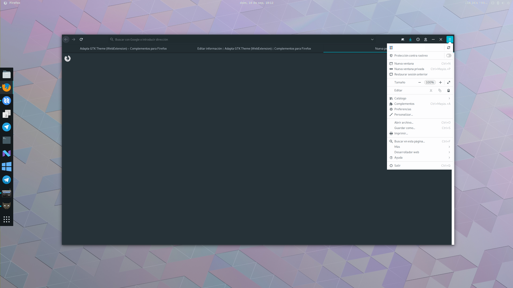

# firefox-material-adapted
Adapta GTK Mod for Firefox 57+. Adapta is an adaptive Gtk+ theme based on Material Design Guidelines. Adapta is one of the most popular GTK themes available for Linux. Now is available for Firefox too via Mod.

## Installation
1. Download [Firefox](https://www.mozilla.org/) web browser.
2. Download the [latest release](https://github.com/ferlanero/firefox-material-adapted) of Material Adapted mod.
3. Copy userChrome.css and userContent.css to `./local/.mozilla/firefox/xxxxxxxx.default-xxxxxxxx/chrome/ `.
4. Start Firefox to apply the new Material Adapted mod.
5. Install the [Adapta GTK Theme (WebExtension) from Firefox Add-ons](https://addons.mozilla.org/es/firefox/addon/adapta-theme-webextension/?src=userprofile#&gid=1&pid=1) to completely match the Adapta GTK Theme guidelines
